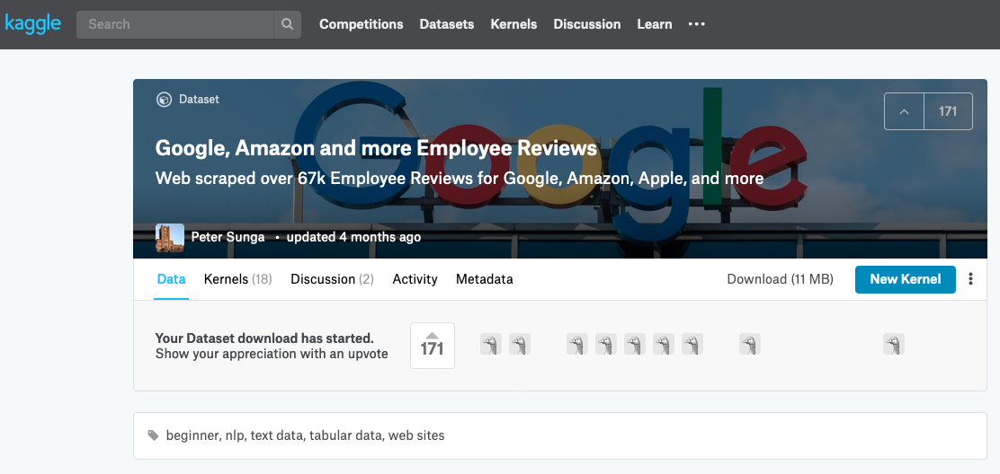
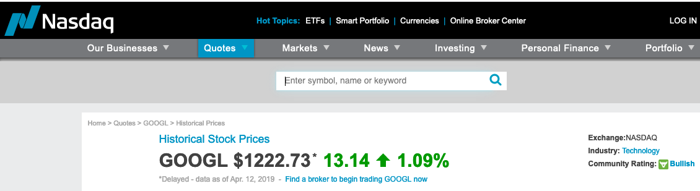

## Project Report

# Google Stock Value vs. Employee Review
We are getting the historical data for the employee review and the stock value for 10 years. After cleaning up and joining the data by date, we will push it to SQL database.

# Project Proposal

Before we have started writing any code, we thought there would be a positive relation between the employee reviews and the stock prices of the company as happy cows yield more milk.

# *Extract:*
# Data Sources

## Google Employee Review from Kaggle
The customer review data for the companies is taken from the Kaggle source, including Google, Apple, Microsoft and so on, whereas we will only use Google data after clean up.

## Google Stock Values from Nasdaq

Historical Google Stock Values for the last 10 years is pulled from from Nasdaq in the CSV format. 
The date formats are different we need to transform for to match with the employee review data.

# Guidelines for ETL Project

To start, we will be extracting the raw data from Kaggle website in csv format for the Google review and NASDAQ stock prices through the downloaded CSV files and inputting the information into two Pandas Data frames.

# *Transform:*
For the clean up Google review data,we selected only the current employees and the anonymous reviews to be objective. Also we filtered NASDAQ data frame by dates and closing stock price for last 10 years. We combine the two data fames on dates by left join for the review dates since the review may have some missing dates. Then we have filtered and aggragted them by month only using groupby method. 

# *Load:*

From there, the data was concatenated into one data frame. After this step, the single data frame was uploaded to a relational database, i.e. MySQL database named "Google_review". Since we had no way to create the database we had use MYSQLWorkbench to create the database and the necessary table with the auto-increment primary key. The data would be easier to sort by date and pull the information needed for the targeted month.
The database features the information including dates, overall_ratings and stock price.

